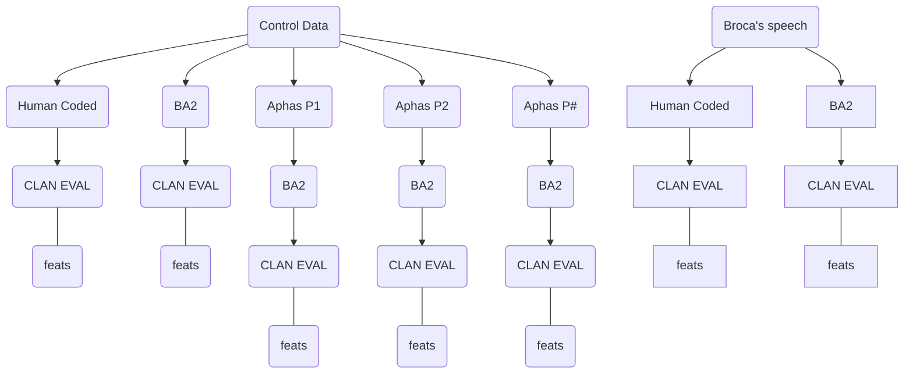

```mermaid
graph TD
%% Main Categories
Control(Control Data)
Broca(Broca's speech)

%% Control Path
Control --> HC_Box(Human Coded)
HC_Box --> Clan1(CLAN EVAL)
Clan1 --- Feats1(feats)

Control --> BA_Box1(BA2)
BA_Box1 --> Clan2(CLAN EVAL)
Clan2 --- Feats2(feats)

%% Aphasia Sub-path under Control
Control --> Aphas1(Aphas P1)
Control --> Aphas2(Aphas P2)
Control --> Aphas3(Aphas P#)

Aphas1 --> BA_Box2(BA2)
BA_Box2 --> Clan3(CLAN EVAL)
Clan3 --- Feats3(feats)

Aphas2 --> BA_Box3(BA2)
BA_Box3 --> Clan4(CLAN EVAL)
Clan4 --- Feats4(feats)

Aphas3 --> BA_Box4(BA2)
BA_Box4 --> Clan5(CLAN EVAL)
Clan5 --- Feats5(feats)

%% Broca's Speech Path
Broca --> HCoded[Human Coded]
HCoded --> Clan6[CLAN EVAL]
Clan6 --- Feats6[feats]

Broca --> BR_Box2[BA2]
BR_Box2 --> Clan7[CLAN EVAL]
Clan7 --- Feats7[feats]
```

Example of feature acqusition process for comparisons.